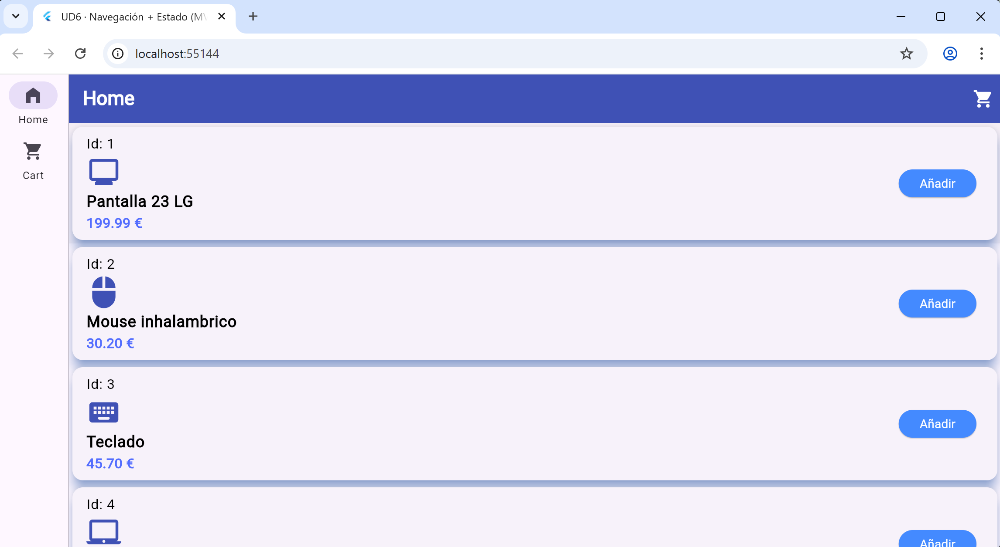
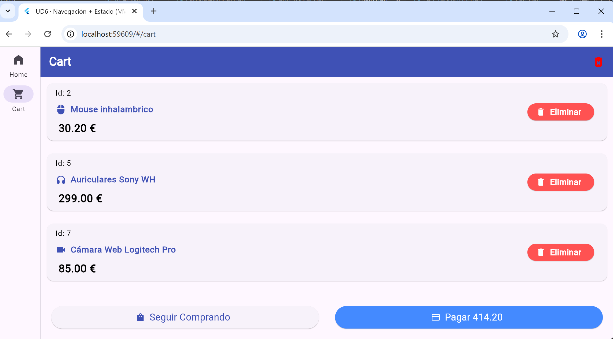
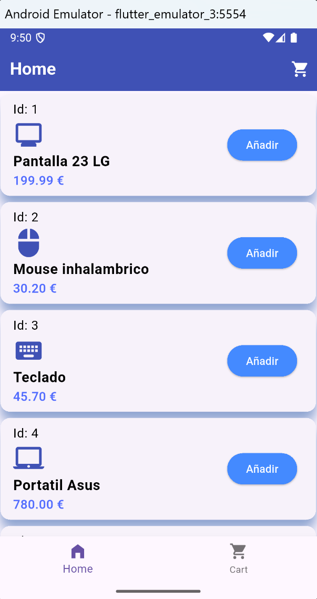
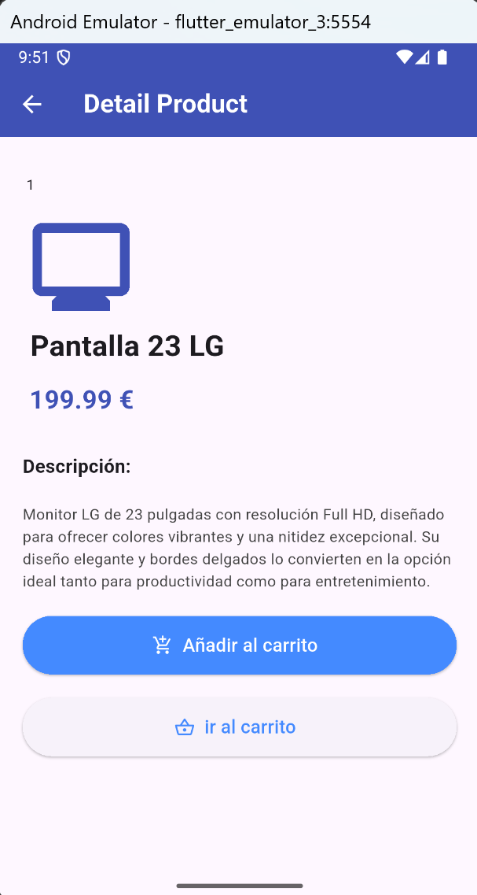
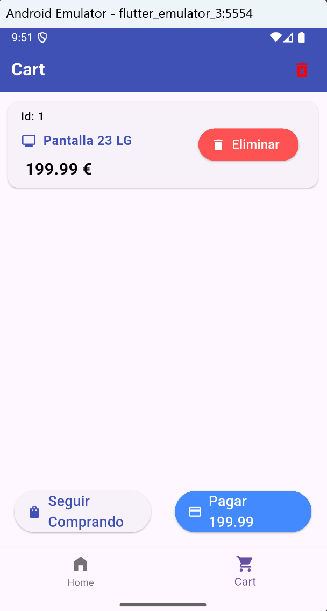
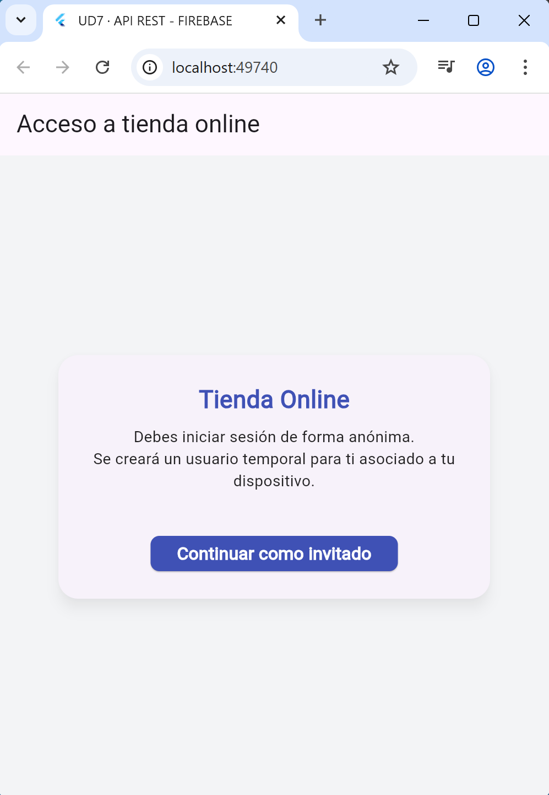
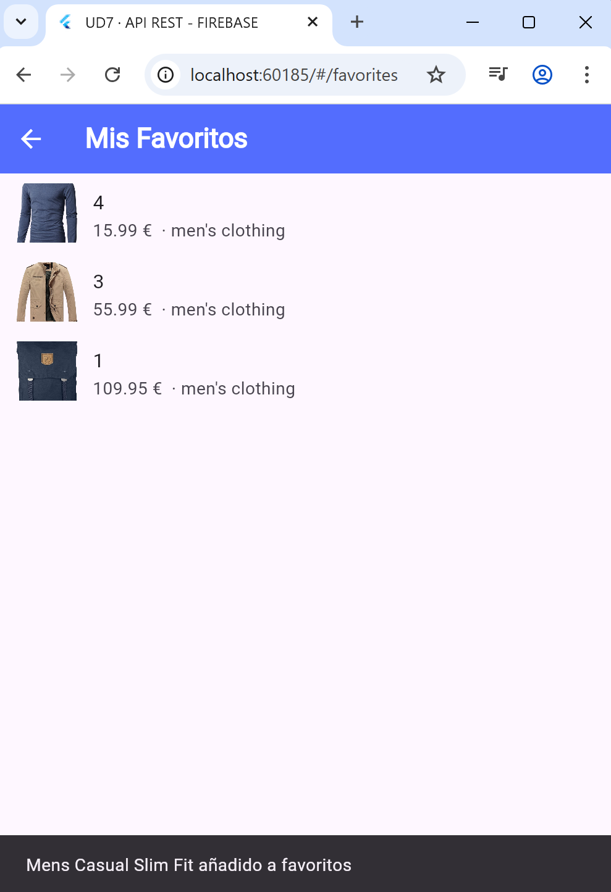

# APP TIENDA ONLINE UD6 Y UD7

# UD6 (BASE)
# app_navegacion_estado

## Arquitectura

Este proyecto sigue la estructura MVVM para separar las responsabilidades

-- La carpeta data contiene los archivos relacionados con los datos (model). Aqui tenemos los archivos correspondientes a la clase Producto, cart_repository que se encarga de modificar la lista inmutable del carrito que solo se puede modificar dentro de esta clase.

--La carperta state contiene el archivo carViewModel (viewModel) es la encargada de exponer el estado y las acciones a la ui y de conectarse con el repositorio del model y notificar cambios a las vistas.

--La carpeta screen contiene los archivos de las vistas de la app, estas vistas solo "escuchan" al viewmodel con el Provider.

## Rutas y navegación

Usamos el archivo app_router para la navegación con GoRouter, aqui tenemos todas las rutas de navegación hacia cada pantalla de la app.
Usamos context.goNamed para navegar a alguna pantalla especifica y context.pushNamed('ruta', extra: objeto) cuando queremos navegar enviando un objeto, en nuestro caso un producto.

## Responsive

Se ha creado dentro de la carpeta widgets, un widget personalizado llamado responsiveScaffold que devuelve un LayoutBuilder donde dependiendo del tamaño de la pantalla (800px), devuelve un scaffold con un BottomNavigationBar si la pantalla es de menos de 800px o un NavigationRail si la pantalla es de mas de 800px. Este widget lo usamos en las pantallas de home y de cart envolviendo con éste el scaffold de cada pantalla.

## Uso del paquete ui_components

Usamos el paquete ui_components donde tenemos nuestro archivo ProductCard que es un widget personalizado y reutilizable que nos ayuda a crear una tarjeta con los detalles del producto que necesitamos mostrar (Actualmente la usamos para "pintar" la lista de productos disponibles).

## Capturas de la app 

## Nota

Esta App se ampliará en la UD7

## 18/enero/2026

## inicio unidad 7 (AMPLIACIÓN)
Debido a que la unidad 6 no estaba calificada al empezar la unidad 7 y que no queria tocar nada de ese código debido a que estaba subido como un repositorio público, he decidico compiar toda la unidad 6 y comenzar desde alli en un repo nuevo.

## Tienda Online (UD7) · API REST + Firebase (continuación de la unidad 6)

- Consumo de una **API REST pública** (FakeStoreAPI)
- **Firebase Auth** (Login anónimo)
- **FireStore** para poder guardar los favoritos del usuario, mostrarlos y usarlos en los informes

## Arquitectura (MVVM)
 
 - **data/** → Modelos y repositorios  
  Contiene Product (modelo de producto) y CartRepository (lógica del carrito). Se creó un nuevo producto llamado producto para que se adaptara a los datos de la API.

- **state/** → ViewModels / Providers  
  Contiene CartViewModel (estado del carrito) y ProductListViewModel (estado de lista de productos desde API REST).

- **screens/** → Pantallas (UI)  
  Contiene las pantallas principales: AuthScreen, HomeScreen, DetailScreen , CartScreen, FavoritesScreen, etc.  
  Las vistas escuchan a los ViewModels mediante Provider.

- **api/** → Cliente REST  
  Contiene ApiClient, encargado de realizar la petición HTTP a la API y devolver una lista de productos.

- **services/** → Servicios externos  
  Contiene FirebaseService, encargado de autenticación y operaciones con Firestore.

  ## API REST (FakeStoreAPI)

  La app obtiene los productos desde la API pública:
  https://fakestoreapi.com/products

  -Usamos http
  - Los datos don Json que se transforman a objetos Product mediante Product,fromJson
  - Gestionan estados en la UI:
    - Cargando
    - Errores
    - Sin resultados
    - La lista de productos correcta con ListView.builder

## Firebase (Auth + Firestore)

## Autenticación
La app usa login anónimo creamdo un usuario temporal único por dispositivo

## Firestore (para los favoritos)
Cada usuario tiene su propia coleccion de favoritos en: 
 users/<uid>/favorites

 Se guardan datos del producto:
 - title
 - price
 - category
 - imageUrl
 - createdAt
 
 Los favoritos se muestran en una pantalla con StreamBuilder

 ## Configuración Firebase (IMPORTANTE)

Este repositorio es público, por lo que **no se incluyen archivos de configuración de Firebase**.

## Informe (Tabla + Gráfico) 
Se ha añadido una pantalla de informe ReportScreen que muestra un análisis simple basado en los productos de la API

- **Tabla (DataTable)** cin titulo, categoria y precio.
- **Filtro por categoria** usando un DropdownButton
- **Cálculo** total de productos filtrados
- **Gráfico de barras con fl_chart** con el resultado de productos por categoria
 
 ## Dependencias añadidas en la UD7

 - http -> consumo de API REST
 - firebase_core -> inicialización de Firebase
 - Firebase_auth -> login anónimo
 - cloud_firestore -> favoritos persistentes
 - fl_chart -> gráfico del informe

 
 ## Capturas UD7

 
 
 
 

## Pasos de inatalación y ejecución

1) Requisitos
· Tener Flutter instalado
· Tener un emulador Android y/o Chrome disponible

2) Instalar dependencias
 - En la carpeta del proyecto con flutter pub get

3) Ejecutar la App
- flutter run

## Configuración API REST (FakeStoreAPI)

La app usa esta API:
  - https://fakestoreapi.com/products

si quieres cambiar la api lo debes hacer en:
- lib/api/api_client.dart
- Variable baseUrl

## Configuración Firebase (Auth + Firestore)

Para que funcione login anónimo y favpritos, Firebase debe estar configurado.

Firebase genera el archivo:
- lib/firebase_options.dart
y se inicializa en main.dart
- Firebase.initializaApp( options: DefaultFirebaseOptions.currentPlatform,);

**Importante sobre repositorios públicos**

Este repositorio es público, asi que NO se suben archivos sensibles como:

- lib/firebase_options.dart
- android/app/google-services.json
Cada persona debe generarlos en su ordenador con FlutterFire CLI:

1) Instalar FlutterFire CLI desde cualquier terminal

- dart pub global activate flutterfire_cli

2) Configurar Firebase dentro del proyecto
En la raiz del proyecto (donde esta el pubspec.yaml) ejecutar: 
 - flutterfire configure

 Esto permitirá selecionar:
 - El proyecto Firebase
 - Las plataformas (Android, Web, Windows, Mac e IOS)

 Al terminar, FlutterFire generará automaticamente:

 - lib/firebase_options.dart
 - andriod/app/google-services.json 

