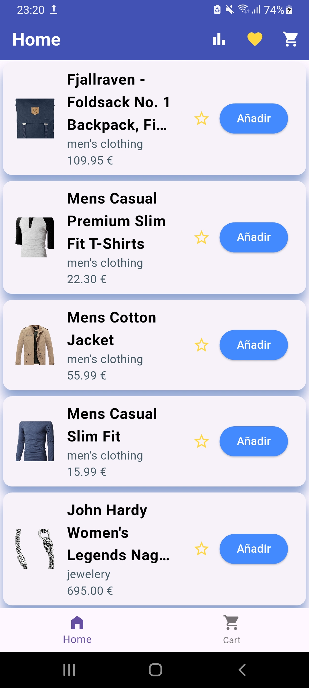
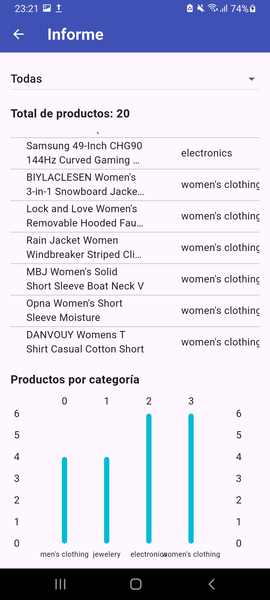
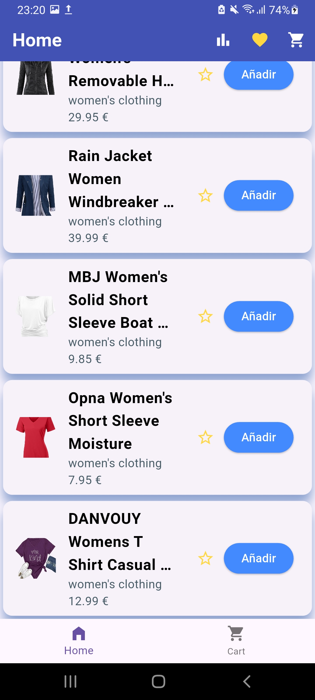
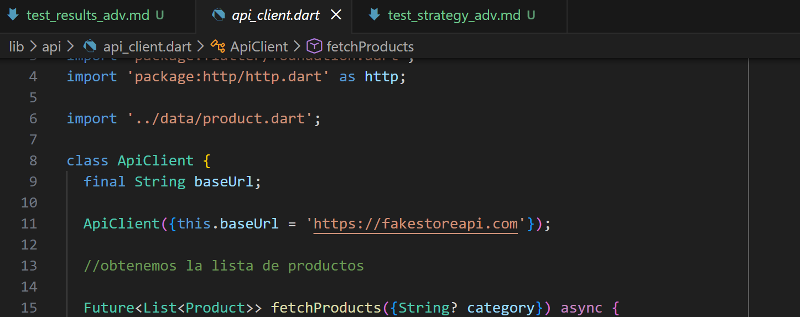
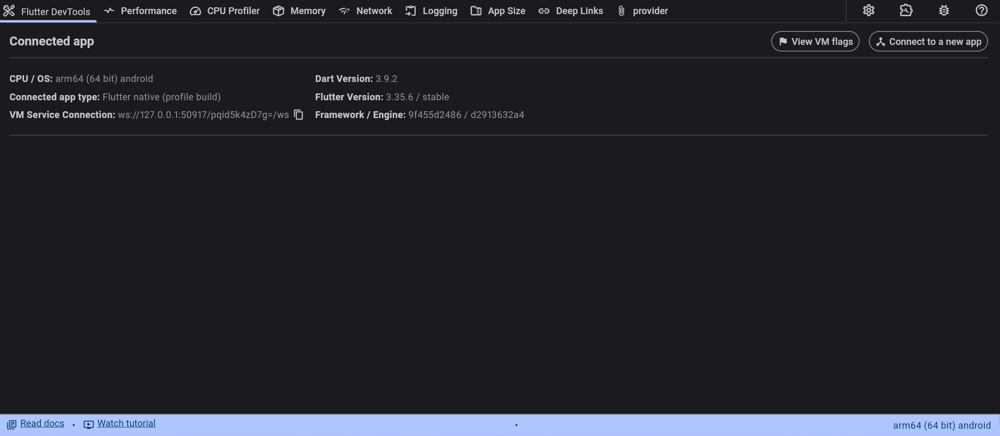
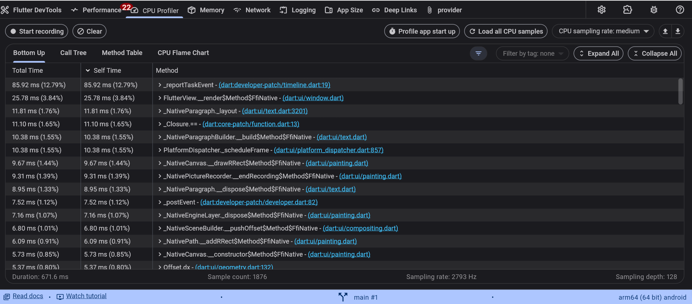
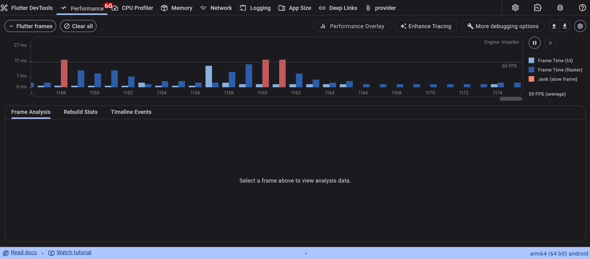
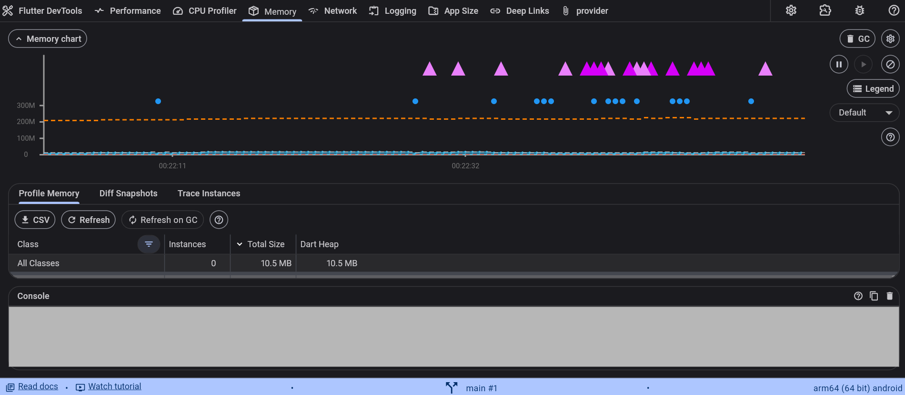
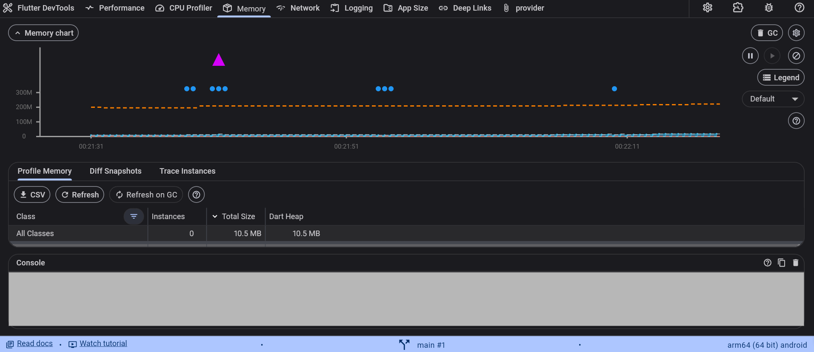

# Resultados de pruebas avanzadas – UD7

## 1. Entorno de pruebas
- Sistema operativo: Windows 11
- Flutter SDK: (3.35.6)
- Dispositivo: Android (dispisitivo físico) + Chrome (Web)
- Conexión: Wi-Fi
- Fecha: 21/01/2026

---

## 2. Resultados por caso

##                Caso A — Volumen / Estrés (manual)

**Acción repetida:** entrar a Informe → cambiar filtro → volver → scroll en Home  
**Nº de repeticiones:** 30

**Observaciones:**
- Errores detectados: 0
- Pantallas en blanco: 0
- Cierres inesperados: 0
- Latencia percibida: baja

**Evidencias:**
- 
- 
- 
- 

##                Caso B — Seguridad (manual)

### Verificación HTTPS

**Comprobación:**
- API usada: "https://fakestoreapi.com/products"

**Resultado:**
- Todas las peticiones se realizan por HTTPS (OK)

**Evidencia:**

- 

#                Caso C — Recursos (CPU y Memoria)

**Modo:** Profile  

**Tiempo observado:** 60s  

**Pantallas usadas:** Home + Informe + cambio de filtro

**Resultados aproximados (DevTools):**
- Pico Memoria:  10.5 MB 
- Pico CPU: 12.79 %
- Fluidez UI: OK (sin congelaciones)
Nota: Valores aproximados según snapshot de Devtools en ese momento.

**Evidencia:**

- 
- 
- 
- 
- 
- 

##                          3. Conclusiones

- La app soporta uso repetido sin fallos graves.

- Seguridad básica correcta: consumo de API por HTTPS.

- Consumo de recursos aceptable.

##                         4. Mejoras propuestas 

1. **Optimizar tabla del informe:** reducir columnas o limitar filas mostradas para mejorar rendimiento.

2. **Mejorar control de favoritos en Web:** asegurar persistencia de sesión en Firebase Auth y UX más clara.

3. **Instaurar inicio de sesión autenticado con email/contraseña**
